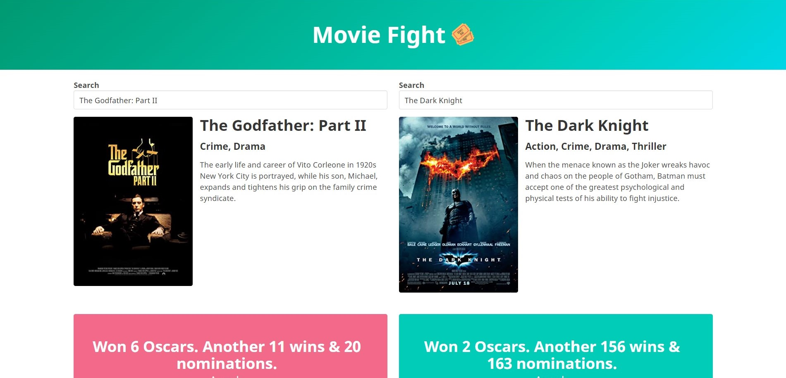

## MovieVersus App

- [Setup](#setup)

- [General info](#general-info)

- [Technologies](#technologies)

## Setup

To run this project, install it locally using npm:

```

$ cd ../project_folder

$ npm install

$ npm start

```

## General info

This app will let you compare your favorite movies and compare them througth their awards winnings, boxoffices earnings, metascore, imdb rating and votes!



## Technologies

Project is created with:

- ReactJS
- SASS
- Bulma
- IMDB API
